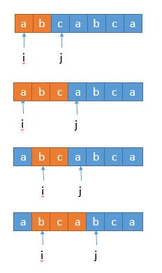
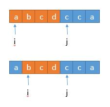

# 1. TwoSum

Given an array of integers `nums` and an integer `target`, return *indices of the two numbers such that they add up to `target`*.

You may assume that each input would have ***exactly\* one solution**, and you may not use the *same* element twice.

You can return the answer in any order.

**Example 1:**

```
Input: nums = [2,7,11,15], target = 9
Output: [0,1]
Output: Because nums[0] + nums[1] == 9, we return [0, 1].
```

**Example 2:**

```
Input: nums = [3,2,4], target = 6
Output: [1,2]
```

**Example 3:**

```
Input: nums = [3,3], target = 6
Output: [0,1]
```

**Constraints:**

- `2 <= nums.length <= 104`
- `-109 <= nums[i] <= 109`
- `-109 <= target <= 109`
- **Only one valid answer exists.**

**Follow-up:** Can you come up with an algorithm that is less than `O(n2) `time complexity?

==Algorithm==

It turns out we can do it in one-pass. While we are iterating and inserting elements into the hash table, we also look back to check if current element's complement already exists in the hash table. If it exists, we have found a solution and return the indices immediately.

==Code==

```cpp
#include <unordered_map>

class Solution {
public:
    vector<int> twoSum(vector<int>& nums, int target) {
        std::unordered_map<int, size_t> mp; // for num, the element is <num, ind_num>
        std::vector<int> ret;
        
        for (size_t i = 0; i < nums.size(); ++i)
        {
            // search for paired element
            int pair_num = target - nums[i];
            if (mp.find(pair_num) != mp.end()) // found
            {
                ret.emplace_back(i);
                ret.emplace_back(mp[pair_num]);
                return ret;
            }
            else // not found, insert new element to the map
            {
                mp[nums[i]] = i;
            }
        }
        
        return ret;
    }
};
```

# 2. Add Two Numbers

You are given two **non-empty** linked lists representing two non-negative integers. The digits are stored in **reverse order**, and each of their nodes contains a single digit. Add the two numbers and return the sum as a linked list.

You may assume the two numbers do not contain any leading zero, except the number 0 itself.

**Example 1:**


```
Input: l1 = [2,4,3], l2 = [5,6,4]
Output: [7,0,8]
Explanation: 342 + 465 = 807.
```

**Example 2:**

```
Input: l1 = [0], l2 = [0]
Output: [0]
```

**Example 3:**

```
Input: l1 = [9,9,9,9,9,9,9], l2 = [9,9,9,9]
Output: [8,9,9,9,0,0,0,1]
```

**Constraints:**

- The number of nodes in each linked list is in the range `[1, 100]`.
- `0 <= Node.val <= 9`
- It is guaranteed that the list represents a number that does not have leading zeros.


==Algorithm==

首先每一位相加肯定会产生进位，我们用 carry 表示。进位最大会是 1 ，因为最大的情况是无非是 9 + 9 + 1 = 19 ，也就是两个最大的数相加，再加进位，这样最大是 19 ，不会产生进位 2 。下边是伪代码。

- 初始化一个节点的头，dummy head ，但是这个头不存储数字。并且将 curr 指向它。
- 初始化进位 carry 为 0 。
- 初始化 p 和 q 分别为给定的两个链表 l1 和 l2 的头，也就是个位。
- 循环，直到 l1 和 l2 全部到达 null 。
    - 设置 x 为 p 节点的值，如果 p 已经到达了 null，设置 x 为 0 。
    - 设置 y 为 q 节点的值，如果 q 已经到达了 null，设置 y 为 0 。
    - 设置 sum = x + y + carry 。
    - 更新 carry = sum / 10 。
    - 创建一个值为 sum mod 10 的节点，并将 curr 的 next 指向它，同时 curr 指向变为当前的新节点。
    - 向前移动 p 和 q 。
- 判断 carry 是否等于 1 ，如果等于 1 ，在链表末尾增加一个为 1 的节点。
- 返回 dummy head 的 next ，也就是个位数开始的地方。

初始化的节点 dummy head 没有存储值，最后返回 dummy head 的 next 。这样的好处是不用单独对 head 进行判断改变值。也就是如果一开始的 head 就是代表个位数，那么开始初始化的时候并不知道它的值是多少，所以还需要在进入循环前单独对它进行值的更正，不能像现在一样只用一个循环简洁。

==code==

```cpp
/**
 * Definition for singly-linked list.
 * struct ListNode {
 *     int val;
 *     ListNode *next;
 *     ListNode() : val(0), next(nullptr) {}
 *     ListNode(int x) : val(x), next(nullptr) {}
 *     ListNode(int x, ListNode *next) : val(x), next(next) {}
 * };
 */
class Solution {
public:
    ListNode* addTwoNumbers(ListNode* l1, ListNode* l2) {
        typedef ListNode *pNode;
        pNode lResult = new ListNode(); // delete the head node at the end of the function
        pNode current = lResult;
        int carry(0);
        
        while (l1 != nullptr || l2 != nullptr)
        {
            int i1 = (l1 == nullptr) ? 0 : l1->val;
            int i2 = (l2 == nullptr) ? 0 : l2->val;
            
            int sum = i1 + i2 + carry;
            carry = sum / 10;
            
            current->next = new ListNode(sum % 10);
            current = current->next;
            
            if (l1 != nullptr) l1 = l1->next;
            if (l2 != nullptr) l2 = l2->next;
        }
        
        if (carry) { current->next = new ListNode(1); }
        
        // delete the head node
        current = lResult;
        lResult = lResult->next;
        delete current;
        
        return lResult;
    }
};
```

# 3. Longest Substring Without Repeating Characters

Given a string `s`, find the length of the **longest substring** without repeating characters.

**Example 1:**

```
Input: s = "abcabcbb"
Output: 3
Explanation: The answer is "abc", with the length of 3.
```

**Example 2:**

```
Input: s = "bbbbb"
Output: 1
Explanation: The answer is "b", with the length of 1.
```

**Example 3:**

```
Input: s = "pwwkew"
Output: 3
Explanation: The answer is "wke", with the length of 3.
Notice that the answer must be a substring, "pwke" is a subsequence and not a substring.
```

**Example 4:**

```
Input: s = ""
Output: 0
```

**Constraints:**

- `0 <= s.length <= 5 * 104`
- `s` consists of English letters, digits, symbols and spaces.

==解法1：==

假设当 i 取 0 的时候，

j 取 1，判断字符串 str[0,1) 中有没有重复的字符。

j 取 2，判断字符串 str[0,2) 中有没有重复的字符。

j 取 3，判断字符串 str[0,3) 中有没有重复的字符。

j 取 4，判断字符串 str[0,4) 中有没有重复的字符。

做了很多重复的工作，因为如果 str[0,3) 中没有重复的字符，我们不需要再判断整个字符串 str[0,4) 中有没有重复的字符，而只需要判断 str[3] 在不在 str[0,3) 中，不在的话，就表明 str[0,4) 中没有重复的字符。

如果在的话，那么 str[0,5) ，str[0,6) ，str[0,7) 一定有重复的字符，所以此时后边的 j 也不需要继续增加了。i ++ 进入下次的循环就可以了。

此外，我们的 j 也不需要取 j + 1，而只需要从当前的 j 开始就可以了。

综上，其实整个关于 j 的循环我们完全可以去掉了，此时可以理解变成了一个「滑动窗口」。



整体就是橘色窗口在依次向右移动。

判断一个字符在不在字符串中，我们需要可以遍历整个字符串，遍历需要的时间复杂度就是 O（n），加上最外层的 i 的循环，总体复杂度就是 O（n²）。我们可以继续优化，判断字符在不在一个字符串，我们可以将已有的字符串存到 Hash 里，这样的时间复杂度是 O（1），总的时间复杂度就变成了 O（n）。

时间复杂度：在最坏的情况下，while 循环中的语句会执行 2n 次，例如 abcdefgg，开始的时候 j 一直后移直到到达第二个 g 的时候固定不变 ，然后 i 开始一直后移直到 n ，所以总共执行了 2n 次，时间复杂度为 O（n）。

空间复杂度：和上边的类似，需要一个 Hash 保存子串，所以是 O（min（m，n））。

==解法2：==

继续优化，我们看上边的算法的一种情况。



当 j 指向的 c 存在于前边的子串 abcd 中，此时 i 向前移到 b ,此时子串中仍然含有 c，还得继续移动，所以这里其实可以优化。我们可以一步到位，直接移动到子串 c 的位置的下一位！


实现这样的话，我们将 set 改为 map ，将字符存为 key ，将对应的下标存到 value 里就实现了。

由于采取了 i 跳跃的形式，所以 map 之前存的字符没有进行 remove ，所以 if 语句中进行了Math.max ( map.get ( s.charAt ( j ) ) , i )，要确认得到的下标不是 i 前边的。

还有个不同之处是 j 每次循环都进行了自加 1 ，因为 i 的跳跃已经保证了 str[ i , j] 内没有重复的字符串，所以 j 直接可以加 1 。而解法二中，要保持 j 的位置不变，因为不知道和 j 重复的字符在哪个位置。

最后个不同之处是， ans 在每次循环中都进行更新，因为 ans 更新前 i 都进行了更新，已经保证了当前的子串符合条件，所以可以更新 ans 。而解法二中，只有当当前的子串不包含当前的字符时，才进行更新。

时间复杂度：我们将 2n 优化到了 n ，但最终还是和之前一样，O（n）。

空间复杂度：也是一样的，O（min（m，n)）。

```cpp
    int lengthOfLongestSubstring(string s) {
        std::unordered_map<char, int> char_map;
        int max_length = 0; // max substring length
        for (int i = 0, j = 0; j < s.length(); ++j) // i left index, j right index
        {
            if (char_map.count(s[j])) // char_map contains the character
            { 
                // if i < char_map[s[j]] // move i to char_map[s[j]]
                // else, which means s[j] is on the left of i, don't move i
                i = std::max(i, char_map[s[j]]);
            }
            char_map[s[j]] = j + 1; // move i to next position
            
            if (j - i + 1 > max_length) max_length = j - i + 1;
        }
        
        return max_length;
    }
```

==解法3：==

和解法2思路一样，区别的地方在于，我们不用 Hash ，而是直接用数组，字符的 ASCII 码值作为数组的下标，数组存储该字符所在字符串的位置。适用于字符集比较小的情况，因为我们会直接开辟和字符集等大的数组。

```cpp
    int lengthOfLongestSubstring(string s)
    {
        int ascii[128]{}; // acii length 128
        int max_length = 0;
        for (int i = 0, j = 0; j < s.length(); ++j)
        {
            i = std::max(i, ascii[s[j]]); // no need to use if to check
            max_length = std::max(max_length, j - i + 1);
            ascii[s[j]] = j + 1;
        }
        return max_length;
    }
```

和解法 2 不同的地方在于，没有了 if 的判断，因为如果 index[ s.charAt ( j ) ] 不存在的话，它的值会是 0 ，对最终结果不会影响。

时间复杂度：O（n）。

空间复杂度：O（m），m 代表字符集的大小。这次不论原字符串多小，都会利用这么大的空间。

# 4. Median of Two Sorted Arrays

Given two sorted arrays `nums1` and `nums2` of size `m` and `n` respectively, return **the median** of the two sorted arrays.

The overall run time complexity should be `O(log (m+n))`.

**Example 1:**

```
Input: nums1 = [1,3], nums2 = [2]
Output: 2.00000
Explanation: merged array = [1,2,3] and median is 2.
```

**Example 2:**

```
Input: nums1 = [1,2], nums2 = [3,4]
Output: 2.50000
Explanation: merged array = [1,2,3,4] and median is (2 + 3) / 2 = 2.5.
```

**Example 3:**

```
Input: nums1 = [0,0], nums2 = [0,0]
Output: 0.00000
```

**Example 4:**

```
Input: nums1 = [], nums2 = [1]
Output: 1.00000
```

**Example 5:**

```
Input: nums1 = [2], nums2 = []
Output: 2.00000
```

**Constraints:**

- `nums1.length == m`
- `nums2.length == n`
- `0 <= m <= 1000`
- `0 <= n <= 1000`
- `1 <= m + n <= 2000`
- `-106 <= nums1[i], nums2[i] <= 106`

==解法1：==

看到 log ，很明显，我们只有用到二分的方法才能达到。我们不妨用另一种思路，题目是求中位数，其实就是==求第 k 小数==的一种特殊情况，而求第 k 小数有一种算法。

暴力解法中，我们一次遍历就相当于去掉不可能是中位数的一个值，也就是一个一个排除。由于数列是有序的，其实我们完全可以==一半儿一半儿的排除==。假设我们要找第 k 小数，我们可以==每次循环排除掉 k / 2 个数==。看下边一个例子。

假设我们要找第 7 小的数字。


我们比较两个数组的第 k / 2 个数字，如果 k 是奇数，向下取整。也就是比较第 3 个数字，上边数组中的 4 和 下边数组中的 3 ，如果哪个小，就表明该数组的前 k / 2 个数字都不是第 k 小数字，所以可以排除。也就是 1，2，3 这三个数字不可能是第 7 小的数字，我们可以把它排除掉。将 1349 和 45678910 两个数组作为新的数组进行比较。

更一般的情况 A [ 1 ]，A [ 2 ]，A [ 3 ]，A [ k / 2] ... ，B[ 1 ]，B [ 2 ]，B [ 3 ]，B[ k / 2] ... ，如果 A [ k / 2 ] < B [ k / 2 ] ，那么 A [ 1 ]，A [ 2 ]，A [ 3 ]，A [ k / 2] 都不可能是第 k 小的数字。

A 数组中比 A [ k / 2 ] 小的数有 k / 2 - 1 个，B 数组中，B [ k / 2 ] 比 A [ k / 2 ] 大，假设 B [ k / 2 ] 前边的数字都比 A [ k / 2 ] 小，也只有 k / 2 - 1 个，所以比 A [ k / 2 ] 小的数字最多有 k / 2 - 1 + k / 2 - 1 = k - 2 个，所以 A [ k / 2 ] 最多是第 k - 1 小的数。而比 A [ k / 2 ] 小的数更不可能是第 k 小的数了，所以可以把它们排除。

橙色的部分表示已经去掉的数字。


由于我们已经排除掉了 3 个数字，就是这 3 个数字一定在最前边，所以在两个新数组中，我们只需要找第 7 - 3 = 4 小的数字就可以了，也就是 k = 4 。此时两个数组，比较第 2 个数字，3 < 5，所以我们可以把小的那个数组中的 1 ，3 排除掉了。


我们又排除掉 2 个数字，所以现在找第 4 - 2 = 2 小的数字就可以了。此时比较两个数组中的第 k / 2 = 1 个数，4 == 4 ，怎么办呢？由于两个数相等，所以我们无论去掉哪个数组中的都行，因为去掉 1 个总会保留 1 个的，所以没有影响。为了统一，我们就假设 4 > 4 吧，所以此时将下边的 4 去掉。


由于又去掉 1 个数字，此时我们要找第 1 小的数字，所以只需判断两个数组中第一个数字哪个小就可以了，也就是 4 。

所以第 7 小的数字是 4 。

我们每次都是取 k / 2 的数进行比较，有时候可能会遇到数组长度小于 k / 2 的时候。


此时 k / 2 等于 3 ，而上边的数组长度是 2 ，我们此时将箭头指向它的末尾就可以了。这样的话，由于 2 < 3 ，所以就会导致上边的数组 1，2 都被排除。造成下边的情况。


由于 2 个元素被排除，所以此时 k = 5 ，又由于上边的数组已经空了，我们只需要返回下边的数组的第 5 个数字就可以了。

从上边可以看到，无论是找第奇数个还是第偶数个数字，对我们的算法并没有影响，而且在算法进行中，k 的值都有可能从奇数变为偶数，最终都会变为 1 或者由于一个数组空了，直接返回结果。

所以我们采用递归的思路，==为了防止数组长度小于 k / 2 ，所以每次比较 min ( k / 2，len ( 数组 ) ) 对应的数字，把小的那个对应的数组的数字排除==，将两个新数组进入递归，并且 k 要减去排除的数字的个数。递归出口就是当 k = 1 或者其中一个数字长度是 0 了。

时间复杂度：每进行一次循环，我们就减少 k / 2 个元素，所以时间复杂度是 O（log（k）），而 k = （m + n）/ 2 ，所以最终的复杂也就是 O（log（m + n））。

空间复杂度：虽然我们用到了递归，但是可以看到这个递归属于尾递归，所以编译器不需要不停地堆栈，所以空间复杂度为 O（1）。

```cpp
class Solution {
public:
    double findMedianSortedArrays(vector<int>& nums1, vector<int>& nums2) {
        int len1 = nums1.size();
        int len2 = nums2.size();
        
        if ((len1 + len2) & 1) // len1 + len2 odd
        {
            return findKth(nums1, 0, len1-1, nums2, 0, len2-1, (len1+len2)/2 + 1);
        }
        else // even
        {
            return 0.5 *(findKth(nums1, 0, len1-1, nums2, 0, len2-1, (len1+len2)/2) + 
                        findKth(nums1, 0, len1-1, nums2, 0, len2-1, (len1+len2)/2 + 1));
        }
    }

private:
    // find the kth smallest element from two sorted vectors
    int findKth(std::vector<int> &vec1, int start1, int end1,
                std::vector<int> &vec2, int start2, int end2, int k)
    {
        int len1 = end1 - start1 + 1;
        int len2 = end2 - start2 + 1;

        // make sure len1 < len2, so if there is one vector to be empty, it must be vec1
        if (len1 > len2) return findKth(vec2, start2, end2, vec1, start1, end1, k);
        // len1 <= len2
        if (0 == len1) return vec2.at(start2+k-1);
        if (1 == k) return std::min(vec1[start1], vec2[start2]);
        
        int pos1 = start1 + std::min(k/2, len1) - 1;
        int pos2 = start2 + std::min(k/2, len2) - 1;
        
        // tail recursion
        if (vec1[pos1] <= vec2[pos2]) // discard element of vec1 from start1 to pos1
        {
            // it is ok if pos1 + 1 > end1 because of length is end1 - start1 + 1
            return findKth(vec1, pos1 + 1, end1, vec2, start2, end2, k - (pos1 - start1 + 1));
        }
        else
        {
            return findKth(vec1, start1, end1, vec2, pos2+1, end2, k - (pos2 - start2 + 1));
        }
    }
};
```

==解法2：==

我们首先理一下中位数的定义是什么

> 中位数（又称中值，英语：Median），[统计学](https://baike.baidu.com/item/统计学/2630438)中的专有名词，代表一个样本、种群或[概率分布](https://baike.baidu.com/item/概率分布/828907)中的一个数值，其可将数值集合划分为相等的上下两部分。

所以我们只需要将数组进行切。

一个长度为 m 的数组，有 0 到 m 总共 m + 1 个位置可以切。


我们把数组 A 和数组 B 分别在 i 和 j 进行切割。


将 i 的左边和 j 的左边组合成「左半部分」，将 i 的右边和 j 的右边组合成「右半部分」。

- 当 A 数组和 B 数组的总长度是偶数时，如果我们能够保证

    - 左半部分的长度等于右半部分

        i + j = m - i + n - j , 也就是 j = ( m + n ) / 2 - i

    - 左半部分最大的值小于等于右半部分最小的值 max ( A [ i - 1 ] , B [ j - 1 ]）） <= min ( A [ i ] , B [ j ]））

        那么，中位数就可以表示如下

        （左半部分最大值 + 右半部分最小值 ）/ 2 。

        （max ( A [ i - 1 ] , B [ j - 1 ]）+ min ( A [ i ] , B [ j ]）） / 2

- 当 A 数组和 B 数组的总长度是奇数时，如果我们能够保证

    - 左半部分的长度比右半部分大 1

        i + j = m - i + n - j + 1也就是 j = ( m + n + 1) / 2 - i

    - 左半部分最大的值小于等于右半部分最小的值 max ( A [ i - 1 ] , B [ j - 1 ]）） <= min ( A [ i ] , B [ j ]））

        那么，中位数就是

        左半部分最大值，也就是左半部比右半部分多出的那一个数。

        max ( A [ i - 1 ] , B [ j - 1 ]）

上边的第一个条件我们其实可以合并为 j = ( m + n + 1) / 2 - i，因为如果 m + n 是偶数，由于我们取的是 int 值，所以加 1 也不会影响结果。当然，由于 0 <= i <= m ，为了保证 0 <= j <= n ，我们必须保证 m <= n 。

m\leq n,i<m,j=(m+n+1)/2-i\geq(m+m+1)/2-i>(m+m+1)/2-m=0*m*≤*n*,*i*<*m*,*j*=(*m*+*n*+1)/2−*i*≥(*m*+*m*+1)/2−*i*>(*m*+*m*+1)/2−*m*=0

m\leq n,i>0,j=(m+n+1)/2-i\leq (n+n+1)/2-i<(n+n+1)/2=n*m*≤*n*,*i*>0,*j*=(*m*+*n*+1)/2−*i*≤(*n*+*n*+1)/2−*i*<(*n*+*n*+1)/2=*n*

最后一步由于是 int 间的运算，所以 1 / 2 = 0。

而对于第二个条件，奇数和偶数的情况是一样的，我们进一步分析。为了保证 max ( A [ i - 1 ] , B [ j - 1 ]）） <= min ( A [ i ] , B [ j ]）），因为 A 数组和 B 数组是有序的，所以 A [ i - 1 ] <= A [ i ]，B [ i - 1 ] <= B [ i ] 这是天然的，所以我们只需要保证 B [ j - 1 ] < = A [ i ] 和 A [ i - 1 ] <= B [ j ] 所以我们分两种情况讨论：

- B [ j - 1 ] > A [ i ]，并且为了不越界，要保证 j != 0，i != m

    

    此时很明显，我们需要增加 i ，为了数量的平衡还要减少 j ，幸运的是 j = ( m + n + 1) / 2 - i，i 增大，j 自然会减少。

- A [ i - 1 ] > B [ j ] ，并且为了不越界，要保证 i != 0，j != n

    

    此时和上边的情况相反，我们要减少 i ，增大 j 。

上边两种情况，我们把边界都排除了，需要单独讨论。

- 当 i = 0 , 或者 j = 0 ，也就是切在了最前边。

    

    此时左半部分当 j = 0 时，最大的值就是 A [ i - 1 ] ；当 i = 0 时 最大的值就是 B [ j - 1] 。右半部分最小值和之前一样。

- 当 i = m 或者 j = n ，也就是切在了最后边。

    

    此时左半部分最大值和之前一样。右半部分当 j = n 时，最小值就是 A [ i ] ；当 i = m 时，最小值就是B [ j ] 。

    所有的思路都理清了，最后一个问题，增加 i 的方式。当然用二分了。初始化 i 为中间的值，然后减半找中间的，减半找中间的，减半找中间的直到答案。

```cpp
class Solution
{
public:
    double findMedianSortedArrays(vector<int>& nums1, vector<int>& nums2) {
        int len1 = nums1.size(), len2 = nums2.size();
        // Always search on the smaller vector
        if (len1 > len2) { return findMedianSortedArrays(nums2, nums1);}
        
        int left = 0, right = len1;
        
        while (left <= right)
        {
            int mid1 = (left + right) / 2;
            int mid2 = (len1 + len2 + 1) / 2 - mid1;
            
            if (mid2 != 0 && mid1 != len1 && nums2[mid2 - 1] > nums1[mid1]) // mid1 needs to increase
            {
                left = mid1 + 1;
            }
            else if (mid1 != 0 && mid2 != len2 && nums1[mid1-1] > nums2[mid2]) // mid1 needs to decrease
            {
                right = mid1 - 1;
            }
            else// all done, handle the result
            {
                int maxLeft(0);
                if (mid1 == 0) { maxLeft = nums2[mid2 - 1];}
                else if (mid2 == 0) { maxLeft = nums1[mid1 - 1];}
                else { maxLeft = std::max(nums1[mid1 - 1], nums2[mid2 - 1]); }
                if ((len1 + len2) & 1) return maxLeft; // len1 + len2 odd
                
                int minRight(0);
                if (mid1 == len1) { minRight = nums2[mid2];}
                else if (mid2 == len2) { minRight = nums1[mid1];}
                else { minRight = std::min(nums1[mid1], nums2[mid2]);}
                return (maxLeft + minRight) / 2.0;
            }
        }
        return 0.0;
    }
};
```

# 5. Longest Palindromic Substring-Medium

Given a string `s`, return *the longest palindromic substring* in `s`.

**Example 1:**

```
Input: s = "babad"
Output: "bab"
Note: "aba" is also a valid answer.
```

**Example 2:**

```
Input: s = "cbbd"
Output: "bb"
```

**Example 3:**

```
Input: s = "a"
Output: "a"
```

**Example 4:**

```
Input: s = "ac"
Output: "a"
```

**Constraints:**

- `1 <= s.length <= 1000`
- `s` consist of only digits and English letters.

解法1：暴力破解

==解法2：最长公共子串==

根据回文串的定义，正着和反着读一样，那我们是不是把原来的字符串倒置了，然后找最长的公共子串就可以了。例如，S = " caba"，S' = " abac"，最长公共子串是 "aba"，所以原字符串的最长回文串就是 "aba"。

关于求最长公共子串（不是公共子序列），有很多方法，这里用动态规划的方法，可以先阅读下边的链接。

https://blog.csdn.net/u010397369/article/details/38979077

https://www.kancloud.cn/digest/pieces-algorithm/163624

整体思想就是，申请一个二维的数组初始化为 0，然后判断对应的字符是否相等，相等的话

`arr [ i ][ j ] = arr [ i - 1 ][ j - 1] + 1 。`

当 i = 0 或者 j = 0 的时候单独分析，字符相等的话 `arr [ i ][ j ]` 就赋为 1 。

`arr [ i ][ j ]` 保存的就是公共子串的长度。

```java
public String longestPalindrome(String s) {
    if (s.equals(""))
        return "";
    String origin = s;
    String reverse = new StringBuffer(s).reverse().toString(); //字符串倒置
    int length = s.length();
    int[][] arr = new int[length][length];
    int maxLen = 0;
    int maxEnd = 0;
    for (int i = 0; i < length; i++)
        for (int j = 0; j < length; j++) {
            if (origin.charAt(i) == reverse.charAt(j)) {
                if (i == 0 || j == 0) {
                    arr[i][j] = 1;
                } else {
                    arr[i][j] = arr[i - 1][j - 1] + 1;
                }
            }
            if (arr[i][j] > maxLen) { 
                maxLen = arr[i][j];
                maxEnd = i; //以 i 位置结尾的字符
            }

        }
    }
    return s.substring(maxEnd - maxLen + 1, maxEnd + 1);
}
```

再看一个例子，S = "abc435cba"，S’ = "abc534cba" ，最长公共子串是 "abc" 和 "cba" ，但很明显这两个字符串都不是回文串。

所以我们求出最长公共子串后，并不一定是回文串，我们还需要判断该字符串倒置前的下标和当前的字符串下标是不是匹配。

比如 S = " caba "，S' = " abac " ，S’ 中 aba 的下标是 0 1 2 ，倒置前是 3 2 1，和 S 中 aba 的下标符合，所以 aba 就是我们需要找的。当然我们不需要每个字符都判断，我们只需要判断末尾字符就可以。


首先 i ，j 始终指向子串的末尾字符。所以 j 指向的红色的 a 倒置前的下标是 beforeRev = length - 1 - j = 4 - 1 - 2 = 1，对应的是字符串首位的下标，我们还需要加上字符串的长度才是末尾字符的下标，也就是 beforeRev + arr[ i ] [ j ] - 1 = 1 + 3 - 1 = 3，因为 arr[ i ] [ j ] 保存的就是当前子串的长度，也就是图中的数字 3 。此时再和它与 i 比较，如果相等，则说明它是我们要找的回文串。

之前的 S = "abc435cba"，S' = "abc534cba" ，可以看一下图示，为什么不符合。


当前 j 指向的 c ，倒置前的下标是 beforeRev = length - 1 - j = 9 - 1 - 2 = 6，对应的末尾下标是 beforeRev + arr[ i ] [ j ] - 1 = 6 + 3 - 1 = 8 ，而此时 i = 2 ，所以当前的子串不是回文串。

代码的话，在上边的基础上，保存 maxLen 前判断一下下标匹不匹配就可以了。

```java
public String longestPalindrome(String s) {
    if (s.equals(""))
        return "";
    String origin = s;
    String reverse = new StringBuffer(s).reverse().toString();
    int length = s.length();
    int[][] arr = new int[length][length];
    int maxLen = 0;
    int maxEnd = 0;
    for (int i = 0; i < length; i++)
        for (int j = 0; j < length; j++) {
            if (origin.charAt(i) == reverse.charAt(j)) {
                if (i == 0 || j == 0) {
                    arr[i][j] = 1;
                } else {
                    arr[i][j] = arr[i - 1][j - 1] + 1;
                }
            }
            /**********修改的地方*******************/
            if (arr[i][j] > maxLen) {
                int beforeRev = length - 1 - j;
                if (beforeRev + arr[i][j] - 1 == i) { //判断下标是否对应
                    maxLen = arr[i][j];
                    maxEnd = i;
                }
                /*************************************/
            }
        }
    return s.substring(maxEnd - maxLen + 1, maxEnd + 1);
}
```

时间复杂度：两层循环，O（n²）。

空间复杂度：一个二维数组，O（n²）。

空间复杂度其实可以再优化一下。


我们分析一下循环，i = 0 ，j = 0，1，2 ... 8 更新一列，然后 i = 1 ，再更新一列，而更新的时候我们其实只需要上一列的信息，更新第 3 列的时候，第 1 列的信息是没有用的。所以我们只需要一个一维数组就可以了。==但是更新 arr [ i ] 的时候我们需要 arr [ i - 1 ] 的信息，假设 a [ 3 ] = a [ 2 ] + 1，更新 a [ 4 ] 的时候， 我们需要 a [ 3 ] 的信息，但是 a [ 3 ] 在之前已经被更新了，所以 j 不能从 0 到 8 ，应该倒过来，a [ 8 ] = a [ 7 ] + 1，a [ 7 ] = a [ 6 ] + 1 , 这样更新 a [ 8 ] 的时候用 a [ 7 ] ，用完后才去更新 a [ 7 ]，保证了不会出错==。

```java
public String longestPalindrome(String s) {
    if (s.equals(""))
        return "";
    String origin = s;
    String reverse = new StringBuffer(s).reverse().toString();
    int length = s.length();
    int[] arr = new int[length];
    int maxLen = 0;
    int maxEnd = 0;
    for (int i = 0; i < length; i++)
        /**************修改的地方***************************/
        for (int j = length - 1; j >= 0; j--) {
        /**************************************************/
            if (origin.charAt(i) == reverse.charAt(j)) {
                if (i == 0 || j == 0) {
                    arr[j] = 1;
                } else {
                    arr[j] = arr[j - 1] + 1;
                }
            /**************修改的地方***************************/
            //之前二维数组，每次用的是不同的列，所以不用置 0 。
            } else {
                arr[j] = 0;
            }
            /**************************************************/
            if (arr[j] > maxLen) {
                int beforeRev = length - 1 - j;
                if (beforeRev + arr[j] - 1 == i) {
                    maxLen = arr[j];
                    maxEnd = i;
                }

            }
        }
    return s.substring(maxEnd - maxLen + 1, maxEnd + 1);
}
Copy
```

时间复杂度：O（n²）。

空间复杂度：降为 O（n）。

```cpp
#include <algorithm>

class Solution {
public:
    string longestPalindrome(string s) {
        if (s.empty()) { return ""; }
        
        std::string rev(s); // reversed string
        std::reverse(rev.begin(), rev.end());
        
        const int len = s.length();
        
        int arr[len];
        for (int i = 0; i < len; ++i) {arr[i] = 0; } // init
        
        int maxLen(0); // max substring length
        int indEnd(0); // end index of substring
        
        for (int i = 0; i < len; ++i)
        {
            for (int j = len-1; j>= 0; --j)
            {
                if (s[i] == rev[j])
                {
                    if (0 == i || 0 == j) {arr[j] = 1;}
                    else { arr[j] = arr[j-1] + 1; }
                }
                else { arr[j] = 0;}
                
                if (arr[j] > maxLen)
                {
                    int beforeRev = len - 1 - j;
                    int beforeRevEnd = beforeRev + arr[j] - 1;
                    if (beforeRevEnd == i)
                    {
                        maxLen = arr[j];
                        indEnd = i;
                    }
                }
            }
        }
        return s.substr(indEnd-maxLen+1, maxLen);
    }
};
```

解法3：暴力破解优化

解法4：

解法5：