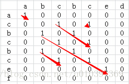
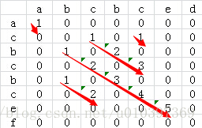

**问题**：有两个字符串str和str2，求出两个字符串中最长公共子串长度。

比如：str=acbcbcef，str2=abcbced，则str和str2的最长公共子串为bcbce，最长公共子串长度为5。

算法思路：
==1、把两个字符串分别以行和列组成一个二维矩阵。==

==2、比较二维矩阵中每个点对应行列字符中否相等，相等的话值设置为1，否则设置为0。==

==3、通过查找出值为1的最长对角线就能找到最长公共子串。==

针对于上面的两个字符串我们可以得到的二维矩阵如下：



从上图可以看到，str和str2共有5个公共子串，但最长的公共子串长度为5。

为了进一步优化算法的效率，我们可以再==计算某个二维矩阵的值的时候顺便计算出来当前最长的公共子串的长度==，即某个二维矩阵元素的值由`item[i][j]=1`演变为`item[i][j]=1 +item[i-1][j-1]`，这样就避免了后续查找对角线长度的操作了。修改后的二维矩阵如下：



好了，算法的思路有了，接下来我们就采用Java语言来实现一个这个算法。

```java
    /**
 * 获取两个字符串最长公共子串长度
 * @param str	第一个字符串
 * @param str2	第二个字符串
 * @return	如果存在则返回最长公共子串长度，否则返回0
 */
public static int getLCSLength(String str, String str2){
	char[] ary = str.toCharArray();
	char[] ary2 = str2.toCharArray();
	
	int[][] temp = new int[ary.length][ary2.length];	//声明一个二维数组，存储最长公共子串长度
	int length = 0;	//最长公共子串长度
	for (int i = 0; i < ary.length; i++) {
		for (int j = 0; j < ary2.length; j++) {
			if(ary[i] == ary2[j]){
				if(i > 0 && j > 0){
					temp[i][j] = temp[i-1][j-1] + 1;
				}else{
					temp[i][j] = 1;
				}
				
				if(temp[i][j] > length){	//当前元素值大于最大公共子串长度
					length = temp[i][j];
				}
			}else{
				temp[i][j] = 0;
			}
		}
	}
	return length;
}
```

针对于上面的代码我们可以看到，在内部循环时，基本上每次都要进行判断i > 0 && j > 0的操作，这些判断相对比较浪费时间，针对于此点可以进行初始化一下，即初始第二维矩阵的第一行和第一列的值。修改后的代码如下：

```java
	/**
	 * 获取两个字符串最长公共子串长度
	 * @param str	第一个字符串
	 * @param str2	第二个字符串
	 * @return	如果存在则返回最长公共子串长度，否则返回0
	 */
	public static int getLCSLength2(String str, String str2){
		char[] ary = str.toCharArray();
		char[] ary2 = str2.toCharArray();
		
		int[][] temp = new int[ary.length][ary2.length];	//声明一个二维数组，存储最长公共子串长度
		int length = 0;	//最长公共子串长度
		
		for(int i = 0; i < ary2.length; i++){	//初始化二维矩阵中的第一行
			temp[0][i] = (ary[0] == ary2[i]) ? 1 : 0;
		}
		
		for(int j = 1; j < ary.length; j++){	//初始化二维矩阵中的第一列
			temp[j][0] = (ary2[0] == ary[j]) ? 1 : 0;
		}
		
		for (int i = 1; i < ary.length; i++) {
			for (int j = 1; j < ary2.length; j++) {
				if(ary[i] == ary2[j]){
					temp[i][j] = temp[i-1][j-1] + 1;
					
					if(temp[i][j] > length){	//当前元素值大于最大公共子串长度
						length = temp[i][j];
					}
				}else{
					temp[i][j] = 0;
				}
			}
		}
		return length;
	}
```

再优化：只要斜着遍历，找到最大的值就好了 不需要申请空间

